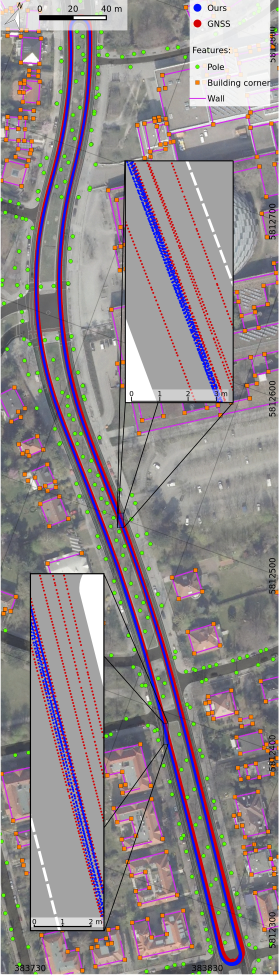

# Source code for the article "Robust LiDAR Feature Localization for Autonomous Vehicles Using Geometric Fingerprinting on Open Datasets"

This repository contains the source code for the article "Robust LiDAR Feature Localization for Autonomous Vehicles Using Geometric Fingerprinting on Open Datasets" published in the [IEEE Robotics and Automation Letters](https://ieeexplore.ieee.org/document/9363614) and presented at the 2021 International Conference on Robotics and Automation (ICRA 2021).
A preprint is available for download under this [link](http://www.mi.fu-berlin.de/inf/groups/ag-ki/publications/Robust-Lidar/index.html).

# Results
Here a comparison of a GNSS localization and the feature localization: 
 
Satellite imagenary: Geoportal Berlin / “Digitale farbige Orthophotos 2019 (DOP20RGB)”, [dl-de/by-2-0](https://www.govdata.de/dl-de/by-2-0), https://www.stadtentwicklung.berlin.de/geoinformation/ 
Map data: “Straßenbefahrung 2014”, [dl-de/by-2-0](https://www.govdata.de/dl-de/by-2-0), https://www.stadtentwicklung.berlin.de/geoinformation/

# Citation
If you use our work in your research, please consider citing our article:
~~~
@ARTICLE{steinke21,
  author={N. {Steinke} and C. -N. {Ritter} and D. {Goehring} and R. {Rojas}},
  journal={IEEE Robotics and Automation Letters},
  title={Robust LiDAR Feature Localization for Autonomous Vehicles Using Geometric Fingerprinting on Open Datasets},
  year={2021},
  volume={6},
  number={2},
  pages={2761-2767},
  doi={10.1109/LRA.2021.3062354}
}
~~~

# License
Copyright 2021 Dahlem Center for Machine Learning and Robotics, Freie Universität Berlin 
 
Redistribution and use in source and binary forms, with or without modification, are permitted provided that the following conditions are met: 
 
1. Redistributions of source code must retain the above copyright notice, this list of conditions and the following disclaimer. 
 
2. Redistributions in binary form must reproduce the above copyright notice, this list of conditions and the following disclaimer in the documentation and/or other materials provided with the distribution. 
 
3. Neither the name of the copyright holder nor the names of its contributors may be used to endorse or promote products derived from this software without specific prior written permission. 
THIS SOFTWARE IS PROVIDED BY THE COPYRIGHT HOLDERS AND CONTRIBUTORS "AS IS" AND ANY EXPRESS OR IMPLIED WARRANTIES, INCLUDING, BUT NOT LIMITED TO, THE IMPLIED WARRANTIES OF MERCHANTABILITY AND FITNESS FOR A PARTICULAR PURPOSE ARE DISCLAIMED. IN NO EVENT SHALL THE COPYRIGHT HOLDER OR CONTRIBUTORS BE LIABLE FOR ANY DIRECT, INDIRECT, INCIDENTAL, SPECIAL, EXEMPLARY, OR CONSEQUENTIAL DAMAGES (INCLUDING, BUT NOT LIMITED TO, PROCUREMENT OF SUBSTITUTE GOODS OR SERVICES; LOSS OF USE, DATA, OR PROFITS; OR BUSINESS INTERRUPTION) HOWEVER CAUSED AND ON ANY THEORY OF LIABILITY, WHETHER IN CONTRACT, STRICT LIABILITY, OR TORT (INCLUDING NEGLIGENCE OR OTHERWISE) ARISING IN ANY WAY OUT OF THE USE OF THIS SOFTWARE, EVEN IF ADVISED OF THE POSSIBILITY OF SUCH DAMAGE.

# Dependencies
Besides ROS Kinetic the following libraries are needed: 
- geographic-lib
- pcl
- sqlite
- spatialite

# Spatialite-Datebase feature map creation

## Data used in the article
We retrieved the data used for the article from the "Geoportal Berlin" (https://fbinter.stadt-berlin.de/fb/index.jsp) using the application QGIS (https://qgis.org/de/site/), which is capable of retrieving data from WFS sources. We exported the data of our region of interest to csv files and proceeded with the steps below.

## Prepare your data

### Preprocessing of walls and corners
The calculateCorners script calculates wall and corner features that can be used with the fingerprint localization from a geojson file. This file should be called 'buildings.geojson' and it should contain the building outlines as polygons for the area of interest. 
The script will generate two csv files which contain the corners (corners.csv) and walls (walls.csv) that can be used with the 'fingerprintCalculator' script to create a feature map.

### Generate the fingerprints
The python script 'fingerprintCalculator' can be used to generate the fingerprints. It expects the data in a single csv file 'features.csv', one row per feature and no header. 
The fields for pole/corner features are: feature id (e. g. feature number), x-coordinate in utm, y-coordinate in utm, type as defined in Pole message as int.  
The fields for wall/laneline features are: feature id (e. g. feature number), utm-coordinates as wkt (well known text), type as defined in Pole message as int.  
The 'fingerprintCalculator' generates two csv files containing the fingerprints: fingerprints.csv for point features and fingerprintsWalls.csv for wall features.

## Create the Spatialite feature map database
### Import of the feature data
For the creation of the Spatialite feature map database the tool Spatialite-gui can be used. It offers a import function for tables from csv files.
The previously generated files can be imported to the tables 'fingerprints' and 'fingerprintsWalls'.
The files generated with the fingerprintsCalculator script already have the correct headers, so the checkbox "first line contains column names" should be checked. 
Sometimes the wrong type is chosen for the columns during import. Make sure that the fields for the coordinates, dist and angle values is double and the type field is typed as integer. It can be changed after import using the spatialite-browser application or via SQL statements.

### Creation of the spatial indexes
The file 'db_creation' contains all necessary SQL-commands in order to create the indexes. They need to be adjusted for the SRID (Spatial Reference Identifier) that you used to export the data. The Berlin data uses the SRID EPSG: 25833 (ETRS89 / UTM zone 33N), you need to change the SRID for all spatial functions in this grid from 25833 to your SRID. 
When executed the SQL-commands will add a geometry column to the fingerprints and fingerprintsWall tables and create a spatial index as well with some other indexes.

# Used Tf-Frames
- **utm**                   Universal Transversal Mercator coordinate system.
- **map**                   Global robot frame.
- **odom**                  Global odometry robot frame. This frame is used for the feature tracking.
- **base_link**             Robot base frame
- **velodyne_base_link**    LiDAR sensor base frame

# Modules documentation
## SimplePoleDetector
Feature detection class. Is capable of detecting pole features, walls and building corners. Needs a point cloud containing the ring information like it is provided by the ros velodyne driver.

### Input topics
*/sensors/velodyne_points* 
PointCloud2 - Point cloud data as pcl cloud with the fields: x y z intensity ring 
 
*/localization/odometry/filtered_map* 
Odometry - Ego position in map frame 

### Parameters
*/pole_recognition/log_features* 
boolean - write all tracked features to a csv file named csv/poles.csv 

### Dynamic parameters
*detect_corners* 
boolean - enable/disable building corner detection 
 
*detect_walls* 
boolean - enable/disable building wall detection 
 
*initial_confidence* 
double - initial tracking confidence of detected features 
 
*redetection_confidence_increase* 
integer - tracking confidence value increase when tracked features are redetected 
 
*no_redetection_confidence_decrease* 
integer - confidence value decrease when tracked features are not redetected

### Output topics
*/pole_recognition/trackedPolesArray* 
PoleArray - detected features 
 
*/pole_recognition/pole_marker* 
MarkerArray - detected features as Rviz markers for visualization

## Recognizer
Fingerprint matching class. Takes a feature vector and calculates the fingerprints, matches the features to a Spatialite-Database map and calculates a positional offset to the ego position.

### Input topics
*/pole_recognition/trackedPolesArray* 
PoleArray - The feature vector to match against the map 
 
*/localization/odometry/filtered_map* 
Odometry - Ego position in map frame

### Parameters
*/pole_recognition/database_name* 
string - Path to Spatialite-Database map 
 
*/pole_recognition/detect_walls* 
boolean - Enables/Disables wall matching, automatically disabled if database does not contain wall tables.

### Dynamic parameters
*max_search_radius* 
double - Feature matching search radius (default 2.5m). Is automatically increased if no features are matched, decreased if positional offset is low. 
 
*min_rel_dist_tolerance* 
double - minimum relative distance error tolerance for feature association in percent 
 
*max_rel_dist_tolerance* 
double - maximum relative distance error tolerance for feature association in percent 
 
*max_abs_dist_tolerance* 
double - maximum absolute distance error tolerance for feature association 
 
*min_abs_angle_tolerance* 
double - minimum absolute angle error tolerance for feature association 
 
*max_abs_angle_tolerance* 
double - maximum absolute angle error tolerance for feature association

### Output topics
*/pole_recognition/PositionDifference* 
PoseWithCovarianceStamped - Positional and angular offset of the input position compared to the matched features 
 
*/pole_recognition/PoleMatchings* 
PoleMatchArray - A vector of matched feature pairs. 
 
*/pole_recognition/FingerprintsMarkerArray* 
MarkerArray - Visualization of un/matched fingerprints

## position_correction_publisher
Provides the odometry topic for the localization.
### Input topics
*/pole_recognition/PoleMatchings* 
PoleMatchArray - Pole matchings vector from the Recognizer class. 
 
*/localization/odometry/filtered_map* 
Odometry - Ego position in map frame 
 
*/pole_recognition/PositionDifference* 
Odometry - Positional offset calculated by the Recognizer class. 
 
*odometry/gps* 
Odometry - GNSS position for initial localization

### Parameters
*/pole_recognition/csv_file* 
string - Path to for a csv position log file (optional) 
 
*/pole_recognition/log_all_wheels* 
boolean - Log the position of every cars wheel (frame wheel_fr, wheel_br, wheel_bl, wheel_fl) to the csv file (default: false)

### Dynamic parameters
*use_gps* 
boolean - Toggle use of the gps sensor 
 
*max_positional_correction* 
double - max applied positional correction per step [m] 
 
*max_angular_correction* 
double - max applied angular correction per step [rad] 
 
*pose_correction_dampening* 
double - Dampening of cached positional correction in percent 

### Output topics
*/localization/pole_odom* 
Odometry - Feature odometry 
 
*/pole_recognition/FeatureMatchingsMarkerArray* 
MarkerArray - matchings visualization

## utm_map_transform_broadcaster
Provides the map <-> utm tf transform.

### Input topic
*/localization/map_origin* 
GeoPoint - Map origin in WGS84 coordinates
